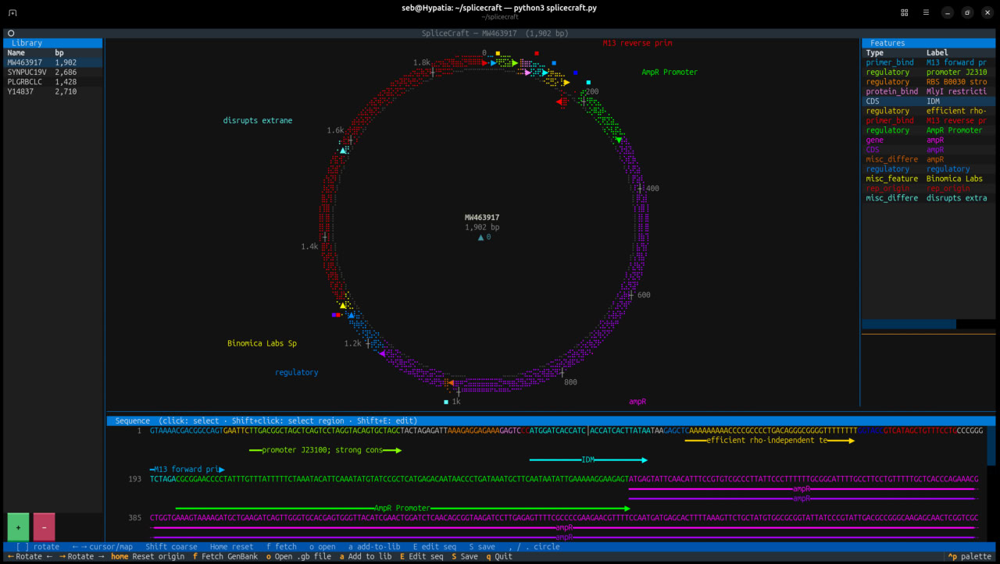

# SpliceCraft

```
╔═══════════════════════════════════════════════════════════════════════════════╗
║ ⠶⠶⠶⠶⠶⠶⠶⠶⠶⠶⠶⠶⠶⠶⠶⠶⠶⠶⠶⠶⠶⠶⠶⠶⠶⠶⠶⠶⠶⠶⠶⠶⠶⠶⠶⠶⠶⠶⠶⠶⠶⠶⠶⠶⠶⠶⠶⠶⠶⠶⠶⠶⠶⠶⠶⠶⠶⠶⠶⠶⠶⠶⠶⠶⠶⠶⠶⠶⠶⠶⠶⠶⠶⠶⠶⠶⠶ ║
║                                                                               ║
║  ________       __________           _________             ____________       ║
║  __  ___/__________  /__(_)____________  ____/____________ ___  __/_  /_      ║
║  _____ \___  __ \_  /__  /_  ___/  _ \  /    __  ___/  __ `/_  /_ _  __/      ║
║  ____/ /__  /_/ /  / _  / / /__ /  __/ /___  _  /   / /_/ /_  __/ / /_        ║
║  /____/ _  .___//_/  /_/  \___/ \___/\____/  /_/    \__,_/ /_/    \__/        ║
║         /_/                                                                   ║
║                                                                               ║
║        ·  I n - T e r m i n a l   P l a s m i d   W o r k b e n c h  ·        ║
║                                                                               ║
║ ⠶⠶⠶⠶⠶⠶⠶⠶⠶⠶⠶⠶⠶⠶⠶⠶⠶⠶⠶⠶⠶⠶⠶⠶⠶⠶⠶⠶⠶⠶⠶⠶⠶⠶⠶⠶⠶⠶⠶⠶⠶⠶⠶⠶⠶⠶⠶⠶⠶⠶⠶⠶⠶⠶⠶⠶⠶⠶⠶⠶⠶⠶⠶⠶⠶⠶⠶⠶⠶⠶⠶⠶⠶⠶⠶⠶⠶ ║
╚═══════════════════════════════════════════════════════════════════════════════╝
```



A terminal-based circular plasmid map viewer and sequence editor, rendered entirely in your
shell. Fetch any GenBank record by accession, load local files, annotate features, and edit
sequences — without ever leaving the terminal.

---

## Features

- **Braille dot-matrix circular map** — plasmids rendered as crisp Unicode braille rings with
  per-strand feature arcs and directional arrowheads
- **Live NCBI fetch** — pull any GenBank record by accession number on demand
- **Local file support** — open `.gb` / `.gbk` files directly from disk
- **Persistent plasmid library** — CommercialSaaS-style left-panel collection saved to JSON; survives
  restarts
- **Feature sidebar** — click a feature row to highlight its arc on the map, or click the map
  to select the feature beneath the cursor
- **Feature detail panel** — qualifiers, strand, coordinates, and CDS amino acid translation
  shown on selection
- **Sequence editor** — full bottom-panel DNA viewer with editable mode, undo/redo history,
  and clipboard support
- **Free rotation** — spin the origin left or right with bracket keys
- **Retro TUI aesthetic** — because biology deserves a terminal that looks this good

---

## Installation

Requires **Python 3.10+**.

```bash
pip install textual biopython
```

Clone the repository:

```bash
git clone https://github.com/Binomica-Labs/SpliceCraft.git
cd SpliceCraft
```

---

## Usage

```bash
# Open the TUI with an empty canvas
python3 splicecraft.py

# Fetch pUC19 from NCBI on launch
python3 splicecraft.py L09137

# Open a local GenBank file
python3 splicecraft.py myplasmid.gb
```

---

## Key Bindings

### Navigation & Map

| Key / Action   | Description                    |
|----------------|--------------------------------|
| `[` / `]`      | Rotate map origin left / right |
| Arrow keys     | Move sequence cursor           |
| `q`            | Quit                           |

### File & Library

| Key / Action   | Description                            |
|----------------|----------------------------------------|
| `f`            | Fetch a record from NCBI by accession  |
| `o`            | Open a `.gb` file from disk            |
| `a`            | Add current plasmid to the library     |

### Editing

| Key / Action       | Description                      |
|--------------------|----------------------------------|
| `E`                | Enter sequence editor mode       |
| `S`                | Save changes to file             |
| `Ctrl+Z`           | Undo                             |
| `Ctrl+Shift+Z`     | Redo                             |
| `Ctrl+C`           | Copy selection to clipboard      |

### Mouse

| Action             | Description                                 |
|--------------------|---------------------------------------------|
| Click              | Place cursor / select feature under pointer |
| Double-click       | Select full feature span                    |
| Drag               | Select a sequence range                     |

---

## Requirements

| Package    | Version  | Purpose                               |
|------------|----------|---------------------------------------|
| Python     | ≥ 3.10   | Runtime                               |
| Textual    | ≥ 0.50   | TUI framework and rendering engine    |
| Biopython  | ≥ 1.83   | GenBank parsing and NCBI Entrez fetch |

---

## License

MIT
